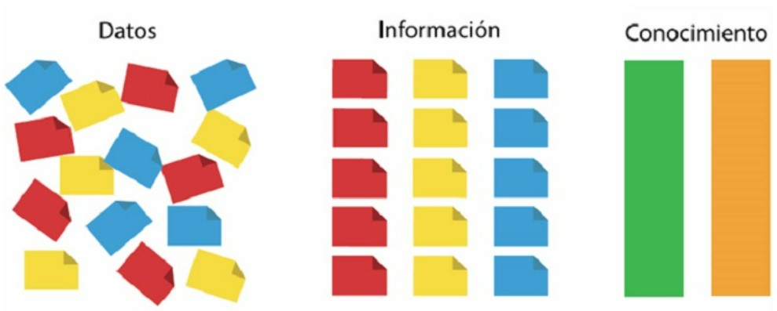

</head>
<body>
  

    
    
De Datos a Conocimiento

  

</body>
</html>

# Convertir los Datos en Conocimiento
### Datos = conjunto de hechos almacenados
### Información = conjunto de datos procesados en tiempo y forma, que constituyen un mensaje relevante y reduce la incertidumbre
### Conocimiento = dota a las personas con la capacidad de tomar decisiones.

## Inteligenia de Negocios (BI)

 - Conocimiento sobre el dominio del negocio
 - Capacidad de describir su comportamiento y comprender aspectos y variables más importantes
 - Darle valor a los datos que el negocio genera
 - Generar información a partir de los datos

## Ecosistema de una organización
Los datos no se encuentran en un único repositorio y puede que no tengan una estructura apta para almacernarlos en una base de datos relacional (RDBMS):
- Sistemas transaccionales para la operatoria diaria: ingreso de datos a través de clientes, operadores, administrativos, usuarios.
- Dispositivos de medición: generan datos

Situación: acceder a varias fuentes, unificar en un repositorio, para luego realizar las consultas de forma confiable para llegar a conclusiones sin errores.

